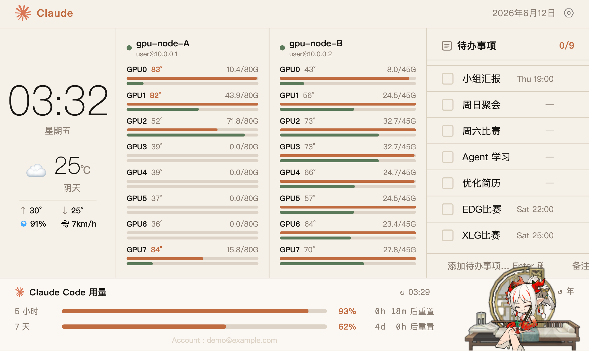
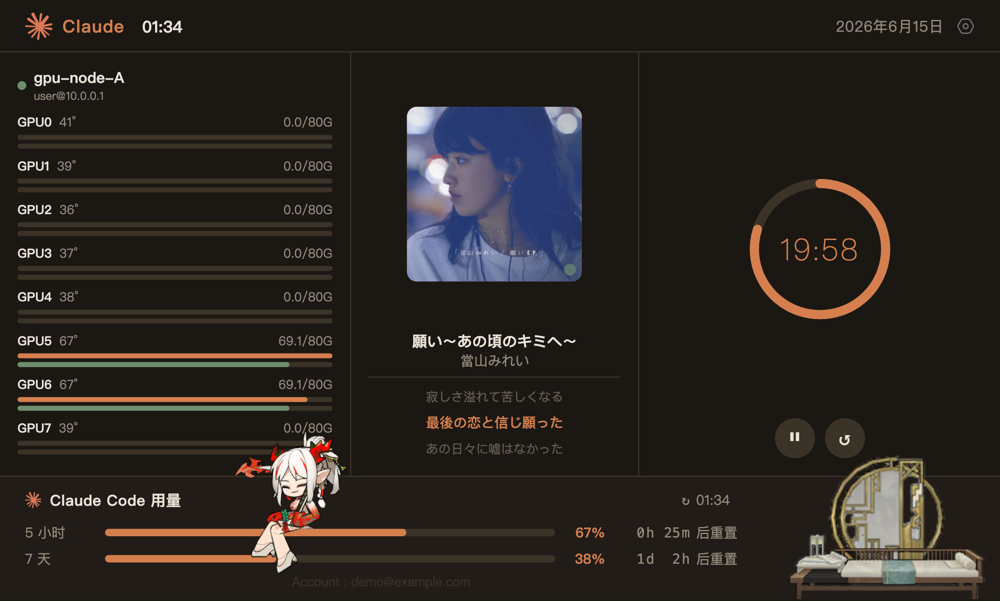
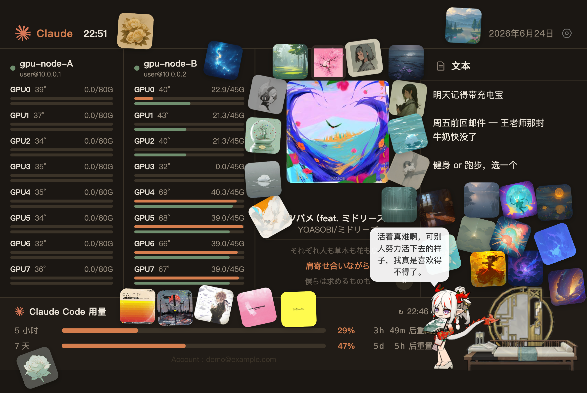
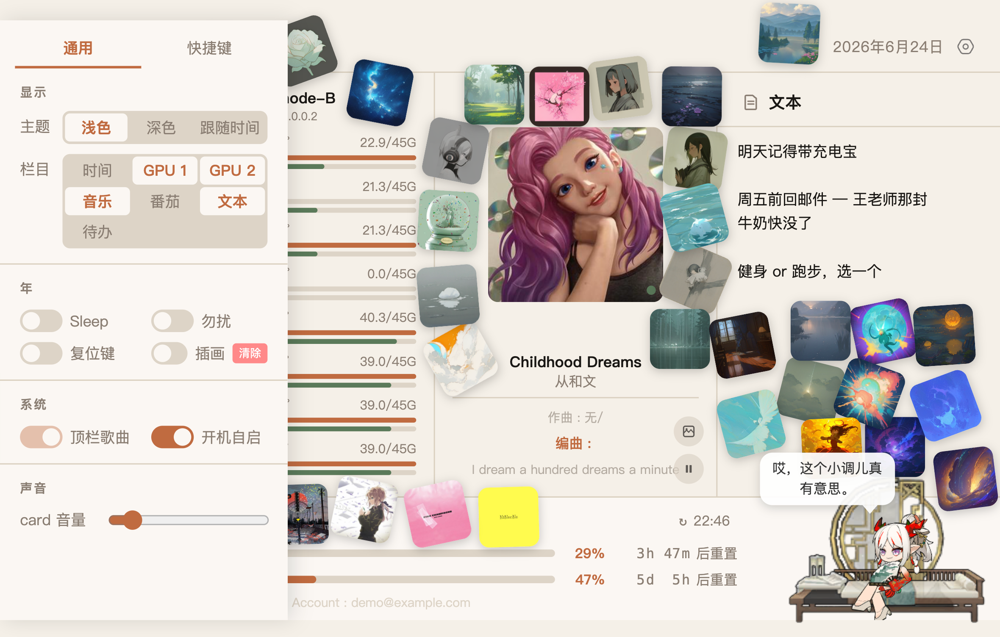

<div align="center">

<h1>Arkpets-Card</h1>

<p>明日方舟桌宠「年」× 桌面信息卡片 | Arknights Desktop Pet + Info Dashboard</p>

<p>
  
  
  
  
  
</p>

<sub><i>部分功能暂时仅支持 macOS</i></sub>

</div>

---

<table width="100%">

<tr>
    <td>
    <td>
  <tr>
  <tr>
    <td>
    <td>
  <tr>

</table>

## 功能

* [ ] **信息面板**

- 时钟与日期
- 实时天气：基于浏览器定位 + [Open-Meteo](https://open-meteo.com/) 免费 API，显示温度、湿度、风速、当日最高/最低温，每 5 分钟自动刷新
- 待办事项：勾选完成、hover 删除、点击时间内联编辑（自由文本）、底部快捷添加，数据存于 localStorage
- 文本：一块随手记的便签，输入即自动保存到 localStorage，刷新/重开不丢
- Claude Code 用量：5 小时 / 7 天双窗口用量条与重置倒计时，数据来自 claude.ai 服务端真实接口
- 音乐：读取 macOS 系统「正在播放」（网易云 / Apple Music / Spotify 等），显示封面、歌名、歌手与**逐句滚动歌词**；歌词与高清封面来自网易云，进度在前端实时插值，歌词丝滑走字（详见下方「音乐」一节）；支持 VIP 无损播放（直接通过 card 播放网易云曲目）
- 深浅色主题：右上角齿轮打开设置，可选浅色 / 深色 / 跟随时间（19:00–7:00 自动深色）
- 用量报警：5 小时额度 ≥80% 时，年会自己走到用量条上、坐在填充末端"值班"；≥95% 躺平，额度重置后庆祝离岗
- 开机自启：设置栏一键开关（macOS launchd）
- GPU 监控：中间栏实时显示远程服务器每张卡的利用率/显存/温度（ssh 免密 + nvidia-smi，连接复用，无人查看时自动停止轮询）；在 `.env` 配置 `GPU_HOST` 即可。每条 GPU 进度条同时是年的可站立横线——多卡服务器就是她的梯子
- 顶栏小组件：
  - **顶栏时间**——关闭「时间」栏时，顶栏 Claude 右侧自动显示当前时间（开着时不重复显示）
  - **顶栏歌曲**——设置栏开关；开启后在顶栏右侧（日期左边）显示小封面 + 歌名。**仅当「音乐」栏关闭时可用**，「音乐」栏打开时开关变灰

**全局快捷键**

- 显示/隐藏 card 窗口、播放暂停、贴/删专辑封面、生成插画（暂停用）、音量 ±5%
- 快捷键可在设置栏「快捷键」页自定义（点击录制），支持即时重注册
- 默认：`⌘⇧C` 显示/隐藏、`⌘⇧P` 播放暂停、`⌘⇧S` 贴/删专辑封面、`⌘⌥↑/↓` 音量

**桌宠「年」**

- Spine WebGL 渲染（Spine 3.8 骨骼模型）
- Markov 状态机驱动行为：Relax / Move / Sit / Sleep / Interact，外加运行时混合出的 **Sit2**（坐姿 + 上半身放松）
- 微表情：光标在身边停留会**转头看向**你、在背后会**转身**；拖拽时身体随惯性甩动（程序化叠加，非新美术）
- 鼠标交互：像素级悬停检测（readPixels），**单击**播放互动动画、**双击**触发特殊动作（Special），可拖拽抛起——释放后受重力下落，落在下落路径上第一条横线上
- 睡觉 / 勿扰：设置栏开关；开启后年会**走回床位**休息（不瞬移），勿扰中被拖走也会自己走回
- 多楼层系统：自动扫描页面 DOM 的可见横向 border 作为「可站立的线」，年会跳上去坐着、再溜达下来
- 位置持久化：F5 刷新不丢位置（sessionStorage），关闭标签页或点用量栏的 ↺ 按钮重置
- **情感模型**：valence × arousal 二维情绪引擎，随交互/音乐/时间漂移，偶发在头顶生成心情插画（≤50×50 思想气泡贴纸，本地 Ollama + Stable Diffusion 生成，无需联网）

## 快速开始

```bash
# 1. 配置
cp .env.example .env   # 按需填写 NETEASE_COOKIE / GPU_HOST 等

# 2. 安装依赖
npm install                  # 包括 electron、@neteasecloudmusicapienhanced/api、jimp 等
brew install media-control   # 音乐功能依赖（见下）

# 3. 一键启动（Electron 无边框窗口）
./start.sh
```

`server.js` 在 Electron 主进程内启动，监听 `localhost:3000`。音乐功能额外依赖 `@neteasecloudmusicapienhanced/api`、`jimp` 与 `media-control`；情感/插画功能依赖本地 Ollama（`qwen2.5:7b`）与 Stable Diffusion（DrawThings / A1111）。其余功能无额外依赖。

> **注意**：停止 card 时请用 `start.sh`（它用 `lsof -ti tcp:3000 -sTCP:LISTEN` 只杀监听方），勿直接 `pkill -f Electron`——VS Code 等也是 Electron 进程，会被误杀。

**开机自启（macOS）**：设置栏（右上角齿轮）里打开"开机自启"开关即可——由本地 server 在 `~/Library/LaunchAgents/` 写入 launchd 配置，登录时自动执行 `start.sh`；关闭开关即移除，不留残留。

## 本地模型（情感系统）

情感功能涉及三个模型，均**可选**——缺失时自动降级，不影响其他功能。

| 用途 | 模型 | 运行方式 | 最低内存 | 降级行为 |
|------|------|----------|----------|----------|
| 独白 / 心境 / 图片 prompt | `qwen2.5:7b` | Ollama | ~6 GB | 跳过 LLM，用情绪模板兜底 |
| 日常闲话 / 单击后续 | `qwen2.5:1.5b` | Ollama | ~2 GB | 直接从原作语录池随机抽取 |
| 心情插画生成 | `gsdf/Counterfeit-V3.0` + `lcm-lora-sdv1-5` | Python / MPS | ~6 GB | 只出文字气泡，不生成图片 |

**安装 Ollama 模型：**

```bash
ollama pull qwen2.5:7b
ollama pull qwen2.5:1.5b
```

**安装图像依赖（M 系列 Mac，MPS 加速）：**

```bash
pip3 install diffusers transformers accelerate torch pillow peft
# 首次出图时自动下载模型（~2.5 GB，缓存至 ~/.cache/huggingface）
```

**纯无模型运行（0 内存开销）：** 关闭 Ollama + 不安装 Python 依赖即可。年的单击会输出原作语录（`NIAN_QUOTES`，10 条硬编码台词），双击无反应。所有其他功能（时钟、天气、音乐、待办、GPU 监控等）不受影响。

## 音乐

桌面端「正在播放」的来源是 macOS 系统级 Now Playing（锁屏/控制中心那套）。**只认音乐 App**（见 `MUSIC_BUNDLES`）——视频、直播、浏览器等不会显示。暂停后（系统可能丢掉 Now Playing 条目）或切到非音乐源时，音乐栏**保留上一首并标记暂停**，不跳回「未播放」。

**为什么用 `media-control` 而不是 `nowplaying-cli`**：macOS 15.4 起 Apple 给 `mediaremoted` 加了 entitlement 校验，普通二进制（含 `nowplaying-cli`、自己编译的 Swift）直连 `MediaRemote.framework` 会被拒返回空。[`media-control`](https://github.com/ungive/media-control) 借系统自带、带授权的 `/usr/bin/perl` 去访问，因此在 macOS 15.4 / 26 上仍可用，且**无需关闭 SIP**。`brew install media-control` 即可。

数据流：

1. 后端起一个**常驻 `media-control stream` 子进程**（取代轮询），实时推送 diff 事件 → 合并入 `musicCache`；前端通过 **SSE `/api/music/events`** 订阅，切歌/暂停即时到达，无延迟
2. 切歌时用「歌名 + 歌手」搜网易云，按 **专辑名 + 歌手 + 时长** 综合打分挑候选；不够确定时再用系统小图当指纹，对候选封面做**感知哈希 + 像素差**比对（`jimp`），锁定正在播放的那一版 → 歌词与高清封面都对得上
3. 封面策略：先显示系统小图保证立即有画面，匹配到高置信版本后**异步替换成网易云高清图**；不确定时保留系统图（虽糊但确为当前曲）
4. 进度由前端用 `elapsedTime + (now − timestamp) × playbackRate` 实时插值，250ms 刷新一次歌词高亮，暂停时自然冻结
5. **VIP 无损播放**：右键贴纸可直接用 card 的 `<audio>` 播该曲（`/api/music/stream` 代理，支持 Range），网易云 app 与 card 两端自动协调（切歌让位、同曲暂停等）

**布局**：歌名/歌手与歌词之间有一条可调横线，在 `claude-dashboard.html` 的 `.music-pane` 里改 `--music-split`（上半区占比，调大→横线下移、封面更大；调小→歌词更多）。封面在「上边界↔歌名」之间居中。

## 用量数据更新（macOS）

`update-usage.js` 通过 AppleScript 向 Chrome 中已登录的 claude.ai 标签页注入 fetch，读取官方用量接口（`/api/account` 取 org → `/api/organizations/{org}/usage`），写入 `usage-data.js`（已 gitignore）。

前置条件：

1. Chrome 中保持一个已登录的 claude.ai 标签页
2. Chrome 菜单开启 View → Developer → Allow JavaScript from Apple Events

手动刷新点面板右上角 ↻，或 cron 定时：

```
*/5 * * * * cd /path/to/card && node update-usage.js
```

## 更换桌宠模型

模型与 [ArkPets-Web](https://github.com/fuyufjh/ArkPets-Web) 同源，来自 [Ark-Models](https://github.com/isHarryh/Ark-Models) 模型库。其 `models/` 目录下每个文件夹是一只干员基建小人，由 `.skel` + `.atlas` + `.png` 三件套组成（具体清单见仓库根目录的 `models_data.json`）。

1. 在 Ark-Models 的 `models/` 中找到想要的干员，下载整个文件夹，放到本项目根目录（与 `2014_nian_nian#4/` 同级）
2. 修改 `claude-dashboard.html` 桌宠模块顶部的四个常量，例如：
   
   ```js
   const MODEL_DIR  = '/xxxx_name/';            // 文件夹名；特殊字符需 URL 编码（如 # → %23）
   const SKEL_KEY   = 'build_char_xxxx_name.skel';
   const ATLAS_KEY  = 'build_char_xxxx_name.atlas';
   const PNG_KEY    = 'build_char_xxxx_name.png';
   ```
3. 刷新页面即可，体型不合适就调 `SCALE`

**注意事项**

- 必须是 Spine 3.8 的**基建小人**（`models/` 目录）；`models_enemies/`（敌人）与 `models_illust/`（动态立绘）动画名不同，不能直接用
- 模型需包含 `Relax` / `Move` / `Sit` / `Sleep` / `Interact` 动画，个别"载具型"模型缺 `Sit`/`Sleep`，暂不支持
- Ark-Models 自 2025 年 3 月起对所有纹理启用了 Premultiplied Alpha；如果新模型渲染出黑边/白边，把 `claude-dashboard.html` 中 WebGL 初始化处的 `premultipliedAlpha: false` 与 `renderer.premultipliedAlpha = false` 改为 `true`

## 致谢与版权

- 行为设计与 Spine 加载方案参考 [ArkPets-Web](https://github.com/fuyufjh/ArkPets-Web) 与 [Ark-Pets](https://github.com/isHarryh/Ark-Pets)
- 模型素材（`2014_nian_nian#4/`）来自 [Ark-Models](https://github.com/isHarryh/Ark-Models)，**版权归属 [鹰角网络 Hypergryph](https://www.hypergryph.com/)**，仅供学习交流，请勿用于商业用途
- 系统播放信息读取依赖 [media-control](https://github.com/ungive/media-control)（BSD-3-Clause）；歌词/封面来自网易云，版权归原权利人所有，仅供学习交流
- `libs/spine-webgl.js` 为 Esoteric Software 的 [Spine Runtime](http://esotericsoftware.com/spine-runtimes-license)，使用需遵守其许可条款
- 本项目与 Anthropic、鹰角网络、网易均无官方关联

## License

代码部分 MIT；素材与第三方运行时遵循各自原始许可（见上）。

