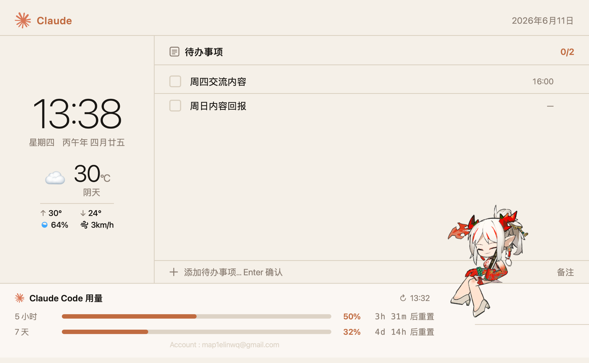

# Arkpets-Card

一块 800×480 的桌面信息卡片：时钟 / 天气 + 待办事项 + Claude Code 用量监控，以及一只会在界面横线之间跳来跳去的明日方舟桌宠「年」。


## 功能

**信息面板**

- 时钟与日期
- 实时天气：基于浏览器定位 + [Open-Meteo](https://open-meteo.com/) 免费 API，显示温度、湿度、风速、当日最高/最低温，每 5 分钟自动刷新
- 待办事项：勾选完成、hover 删除、点击时间内联编辑（自由文本）、底部快捷添加，数据存于 localStorage
- Claude Code 用量：5 小时 / 7 天双窗口用量条与重置倒计时，数据来自 claude.ai 服务端真实接口
- 深浅色主题：右上角齿轮打开设置，可选浅色 / 深色 / 跟随时间（19:00–7:00 自动深色）
- 用量报警：5 小时额度 ≥80% 时，年会自己走到用量条上、坐在填充末端"值班"；≥95% 躺平，额度重置后庆祝离岗
- 开机自启：设置栏一键开关（macOS launchd）
- GPU 监控：中间栏实时显示远程服务器每张卡的利用率/显存/温度（ssh 免密 + nvidia-smi，连接复用，无人查看时自动停止轮询）；在 `.env` 配置 `GPU_HOST` 即可。每条 GPU 进度条同时是年的可站立横线——多卡服务器就是她的梯子

**桌宠「年」**

- Spine WebGL 渲染（Spine 3.8 骨骼模型）
- Markov 状态机驱动行为：Relax / Move / Sit / Sleep / Interact
- 多楼层系统：自动扫描页面 DOM 的可见横向 border 作为「可站立的线」，年会跳上去坐着、再溜达下来
- 鼠标交互：像素级悬停检测（readPixels），点击播放互动动画，可拖拽抛起——释放后受重力下落，落在下落路径上第一条横线上
- 位置持久化：F5 刷新不丢位置（sessionStorage），关闭标签页或点用量栏的 ↺ 按钮重置

## 快速开始

```bash
# 1. 配置
cp .env.example .env   # 按需填写 ACCOUNT_LABEL 等

# 2. 一键启动（拉起 server + Chrome 应用模式无边框窗口）
./start.sh

# 或手动：node server.js 后访问 http://localhost:3000
```

无构建步骤，`server.js` 仅依赖 Node 内置模块。

**开机自启（macOS）**：设置栏（右上角齿轮）里打开"开机自启"开关即可——由本地 server 在 `~/Library/LaunchAgents/` 写入 launchd 配置，登录时自动执行 `start.sh`；关闭开关即移除，不留残留。

## 用量数据更新（macOS）

`update-usage.js` 通过 AppleScript 向 Chrome 中已登录的 claude.ai 标签页注入 fetch，读取官方用量接口（`/api/organizations/{org}/usage`），写入 `usage-data.js`（已 gitignore）。

前置条件：

1. Chrome 中保持一个已登录的 claude.ai 标签页
2. Chrome 菜单开启 View → Developer → Allow JavaScript from Apple Events

手动刷新点面板右上角 ↻，或 cron 定时：

```
*/5 * * * * cd /path/to/card && node update-usage.js
```

## 主要常量（claude-dashboard.html）

| 常量 | 默认值 | 说明 |
|---|---|---|
| `CARD_W × CARD_H` | 800×480 | 卡片尺寸 |
| `SCALE` | 0.4 | 桌宠缩放 |
| `WALK_SPD` | 45 | 行走速度 px/s |
| `JUMP_RANGE` | 65 | 坐下时搜索上下横线的范围 px |
| `SIT_MIN_H` | 30 | 低于此高度的线不可坐（坐姿会穿模） |
| `MAX_FLOOR_Y` | CARD_H−50 | 可落/可坐线的最大高度 |
| `GRAVITY` | 1200 | 拖拽释放后的下落加速度 px/s² |

## 更换桌宠模型

模型与 [ArkPets-Web](https://github.com/fuyufjh/ArkPets-Web) 同源，来自 [Ark-Models](https://github.com/isHarryh/Ark-Models) 模型库。其 `models/` 目录下每个文件夹是一只干员基建小人，由 `.skel` + `.atlas` + `.png` 三件套组成（具体清单见仓库根目录的 `models_data.json`）。

1. 在 Ark-Models 的 `models/` 中找到想要的干员，下载整个文件夹，放到本项目根目录（与 `2014_nian_nian#4/` 同级）
2. 修改 `claude-dashboard.html` 桌宠模块顶部的四个常量，例如：

   ```js
   const MODEL_DIR  = '/xxxx_name/';            // 文件夹名；特殊字符需 URL 编码（如 # → %23）
   const SKEL_KEY   = 'build_char_xxxx_name.skel';
   const ATLAS_KEY  = 'build_char_xxxx_name.atlas';
   const PNG_KEY    = 'build_char_xxxx_name.png';
   ```

3. 刷新页面即可，体型不合适就调 `SCALE`

**注意事项**

- 必须是 Spine 3.8 的**基建小人**（`models/` 目录）；`models_enemies/`（敌人）与 `models_illust/`（动态立绘）动画名不同，不能直接用
- 模型需包含 `Relax` / `Move` / `Sit` / `Sleep` / `Interact` 动画，个别"载具型"模型缺 `Sit`/`Sleep`，暂不支持
- Ark-Models 自 2025 年 3 月起对所有纹理启用了 Premultiplied Alpha；如果新模型渲染出黑边/白边，把 `claude-dashboard.html` 中 WebGL 初始化处的 `premultipliedAlpha: false` 与 `renderer.premultipliedAlpha = false` 改为 `true`

## 致谢与版权

- 行为设计与 Spine 加载方案参考 [ArkPets-Web](https://github.com/fuyufjh/ArkPets-Web) 与 [Ark-Pets](https://github.com/isHarryh/Ark-Pets)
- 模型素材（`2014_nian_nian#4/`）来自 [Ark-Models](https://github.com/isHarryh/Ark-Models)，**版权归属 [鹰角网络 Hypergryph](https://www.hypergryph.com/)**，仅供学习交流，请勿用于商业用途
- `libs/spine-webgl.js` 为 Esoteric Software 的 [Spine Runtime](http://esotericsoftware.com/spine-runtimes-license)，使用需遵守其许可条款
- 本项目与 Anthropic、鹰角网络均无官方关联

## License

代码部分 MIT；素材与第三方运行时遵循各自原始许可（见上）。

